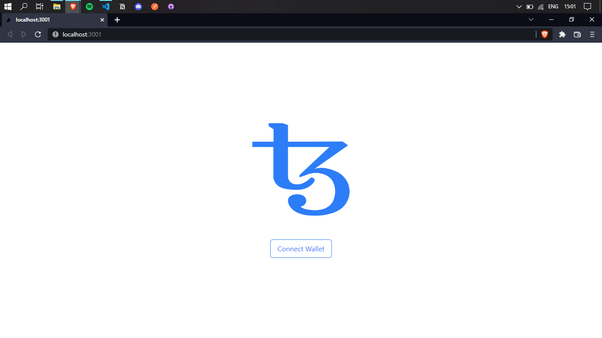
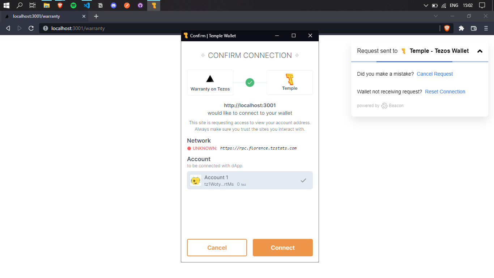
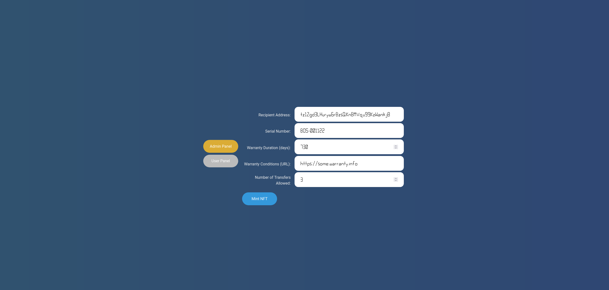
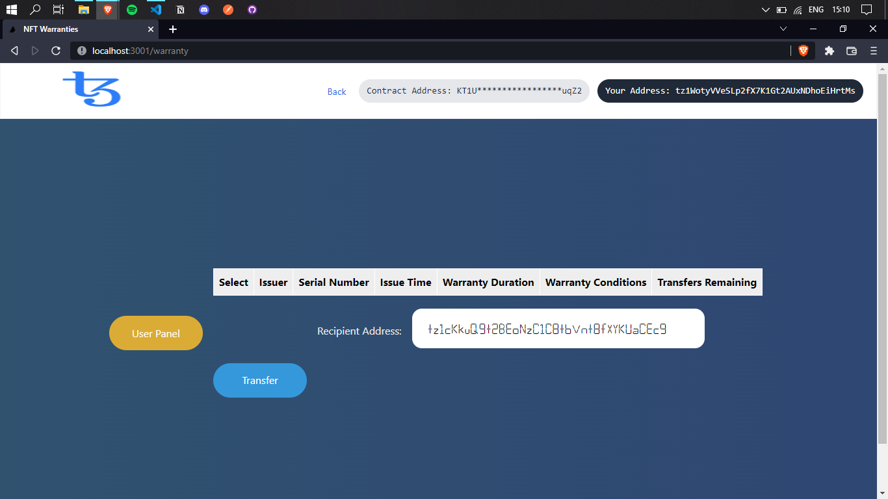

## Problem Statement

The objective is to replace the physical warranty and have block chain based warranty using NFT which will ensure authenticity and security

● Converting ownership authenticity and product warranty cards into decaying NFTs. ● For instance, allow brands and retailers to introduce an NFT for each of their products, which allows customers to receive the physical product along with a digital version of it.
● Customers can then use the digital NFT to verify the authenticity of their product, prove their ownership of their product, and transfer ownership of them upon resale.
● The brand/retailer should also be able to tie the digital NFT to its warranty program, allowing owners to track repairs and replacements to the original item.
● Decay the NFT once the warranty is over. ● You can use the Polygon blockchain to deploy your solution and demo the final product as a web prototype

## Solution

The issues mentioned above are all byproducts of maintaining warranties in the physical world. Tokenize the warranties and many of the problems related to the "real-world" disappear. Not only are the problems resolved, but new possibilities also emerge, such as tracking the exact ownership chain.

With this solution:
- NFTs cannot be falsified.
- A warranty on this NFT DApp is standardized, no matter who issued it or when.
- Finding bad-acting dealers will be simpler since it is easier to scan the blockchain for anomalous behaviors such as multiple warranty NFTs for the same product serial number. 

New Possibilities:
- The number of warranty transfers of a product can be limited and controlled. Some warranties are non-transferable to new owners whereas others offer unlimited transfers. Tokenized warranties can accurately enforce these rules.
- A product's exact ownership chain can be traced.

### Admin Roles

The administrator address is recorded as a part of the smart contract's storage. An administrator has the right to issue to any user a new warranty NFT with its respective metadata such as the product's serial number, the warranty's duration, etc. The administrator can also transfer their privileges to another administrator address.

### User Roles

A user of this smart contract can query the blockchain for the warranty NFTs under their possession. Additionally, a user may transfer any of their warranties that are not yet expired and still have remaining allowed transfers. A user can also delegate custody of a specified warranty NFT to another address. The delegate may then operate on the NFT as if they were the user with the original ownership.

### DApp Web Interface

When running, the DApp will display a homepage and prompt the user to connect their Tezos wallet.

Once connected, the DApp will recognize if the connected wallet is an administrator or not. If so, it will display two panel options, an "Admin Panel" and a "User Panel". If the connected wallet is not an administrator, only the "User Panel" option will be shown.

Under the "Admin Panel", the administrator may enter all of the required information necessary to issue a new warranty NFT to a specified recipient.

Under the "User Panel", a user can view the warranty NFTs under their current possession as well as select any number of them to transfer to a specified recipient. Of course, in order to transfer a selected NFT, it must have transfers allowed. Otherwise, the operation will fail.

## Conclusion

This project presents an NFT application for recording product warranties on the Tezos blockchain. With such a solution, many of the issues around tracking and handling warranties in the physical world are alleviated. Additionally, new possibilities are opened such as exact tracking of a product's ownership over time and precise counting and enforcement of the number of warranty transfers permitted.
.
